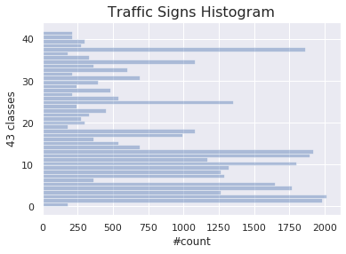

# Traffic Sign Classification Project for Self-Driving Cars

Self-Driving Car Engineer Nanodegree Program

---
## Project Details

In this project, a Deep Convolutional Neural Network (CNN) is implemented to classify traffic signs. A model is trained and validated so it can classify traffic sign images using the [German Traffic Sign Dataset](http://benchmark.ini.rub.de/?section=gtsrb&subsection=dataset). After the model is trained, the model is tested on additional images of German traffic signs found on the internet, that were not previously present in the dataset.

The project submission includes:
* `Traffic_Sign_Classifier.ipynb`: Ipython notebook with the code implementation
* `Traffic_Sign_Classifier.html`: HTML output of the code implementation
* `README.md`: a writeup report covering the implementation details and results
* `Trained model`: the folder `models/0.959/` contains the final trained model achieving 95.9% accuracy


The goals / steps of the project are the following:
* Load the data set
* Explore, summarize and visualize the data set
* Design, train and test a model architecture
* Use the model to make predictions on new images
* Analyze the softmax probabilities of the new images


[//]: # (Image References)

[image1]: ./examples/visualization.jpg "Visualization"
[image2]: ./examples/grayscale.jpg "Grayscaling"
[image3]: ./examples/random_noise.jpg "Random Noise"
[image4]: ./examples/placeholder.png "Traffic Sign 1"
[image5]: ./examples/placeholder.png "Traffic Sign 2"
[image6]: ./examples/placeholder.png "Traffic Sign 3"
[image7]: ./examples/placeholder.png "Traffic Sign 4"
[image8]: ./examples/placeholder.png "Traffic Sign 5"


---
## Implementation Details

### 1) Dataset Summary & Exploration

#### Summary statistics

In the following a basic summary of the dataset is provided. The exploration is done is done from code implementation in the Jupyter notebook. The `pickle` library was used to load the data, `numpy` was used to find the summary statistics below, and finally `seaborn` was used for plotting a histogram of the classes in the dataset.

* The size of training set is `34799`
* The size of the validation set is `4410`
* The size of test set is `12630`
* The shape of a traffic sign image is `(32, 32, 3)` i.e. 32x32 pixels and 3 color channels
* The number of unique classes/labels in the data set is `43`

#### Exploratory visualization of the dataset

Here is an exploratory visualization of the data set. It shows is a histogram bar chart showing the distrubution of the different classes in the dataset. It is clearly seen that the some classes are more present than others. This can potentially negatively affect the accuracy of the final model, as the network will see more classes than others.



Below a random image from the dataset is visualized with the label for that sign.


### 2) Design and Test a Model Architecture

In the following the data preprocessing steps are described, what techniques were chosen and why.

As a first step, the images were converted to grayscale in order to reduce the data complexty and training time. In the given case the color channels are not necessary for the classification task, though colors may give additional accuracy, which have to be tested.

Here is an example of a traffic sign image before and after grayscaling.

![alt text][image2]

As a last step, the image data was normalized between -1 and 1 with a mean of 0 to make sure the training process is more stable by avoiding oscillation whend doing gradient descent and back propagation.


#### Final model architecture

The final model consisted of the following layers below. The final output is the logits. It consists of two convolutional layers and three fully connected layers with RELU activations.

| Layer         		|     Description	        					|
|:---------------------:|:---------------------------------------------:|
| Input         		| 32x32x1 RGB image   							|
| Convolution 3x3     	| 1x1 stride, valid padding, outputs 28x28x6 	|
| RELU					|												|
| Max pooling	      	| 2x2 stride, outputs 14x14x6   				|
| Convolution 3x3	    | 2x2 stride, valid padding, outputs 5x5x16		|
| Flatten   	    	| Output 800   									|
| Fully connected		| Input 800, output 120 						|
| RELU					|												|
| Fully connected		| Input 120, output 84   						|
| RELU					|												|
| Fully connected		| Input 84, output 43 (logits)   				|

#### Training the model

To train the model, the softmax cross entropy with logits was used. It computes the cross entropy between the logits and the labels. It measures the probablity error in the discrete classification task. This can be done because each image only belong to one class i.e. they only have one label. The Adam optimizer was used with a learning rate of 0.002. Different batch sizes were tried and a batch size of 128 was found as a good compromise between training speed and accuracy. Finally, the model was training over 50 epochs. The accuracy starts to perform well and converge after around 10-15 epochs.

#### Finding the solution
<!-- 4. Describe the approach taken for finding a solution and getting the validation set accuracy to be at least 0.93. Include in the discussion the results on the training, validation and test sets and where in the code these were calculated. Your approach may have been an iterative process, in which case, outline the steps you took to get to the final solution and why you chose those steps. Perhaps your solution involved an already well known implementation or architecture. In this case, discuss why you think the architecture is suitable for the current problem. -->

The final model results in a validation accuracy of 95.9% (saved model can be found in /models/0.959/). Running the model on the test set of 12660 images yields an accuracy of 94.5%, which is deemed good and above goal of 93%.

LeNet-5 was tried as the first network architecture. Through the preprocessing and tuning of the learning rate and batch size, it actually performed quite well. There were no problems encountered in the first model. More advanced architectures could have been explored, but for the purpose of reaching the goal, the chosen architecture performed well. No overfitting was seen and the final performance towards the test set also proved that the model performed well for unseen data. Convolutional layers work well for the type of data i.e. image data. Convolutions are known techniques in image processing and are at the state of the art in deep neural networks in computer vision. If fewer training examples had been available there could have been a risk of overfitting, hence dropout layers could have been introduced as regularization. When the training, validation and test accuracy are around the same high values it is good evidence that the model is working as expected. If the validation or test accuracy had been much lower it would had been an indication overfitting. If the all accuricies had been low it would had been an indication of underfitting and a more complex model could have been explored.


### 3) Test the Model on New Images

#### Six new German traffic signs have been found on the internet to test the model

Here are six German traffic signs found on the internet:


The second image might be difficult to classify because it as similar color as the blue sky background. The third image might also be difficult to classify because there are other partially visible traffic signs in the image as well.

#### Model predictions on new traffic signs

Here are the results of the prediction:


The model was able to correctly predict 6 of the 6 traffic signs, which gives an accuracy of 100%. This is of course a very small sample set, and 100% accury should in general never be expected for probabilistic models. With that said, it showed that the model works well for a large range of images, not only the ones from the traffic sign dataset.

#### Prediction accuracy for the six images
 <!-- Describe how certain the model is when predicting on each of the five new images by looking at the softmax probabilities for each prediction. Provide the top 5 softmax probabilities for each image along with the sign type of each probability. (OPTIONAL: as described in the "Stand Out Suggestions" part of the rubric, visualizations can also be provided such as bar charts) -->

The code for making predictions on the final model is located in the cell 16 of the Ipython notebook.

For the first image, the model is quite sure that this is a Speed limit (60 km/hr) (probability of 1.0), and the image does contain a Speed limit (60 km/hr) sign. The top five soft max probabilities were

For the remaining five images the model predicst them quite well towards 1.0 probability for the correct label.

The top five probabilities for the six images respectively are seen in the following. It indeed seems the images are predicted by the model quite well, and should not be seen representative for the overall accuracy in general.

```python
Image 1: [1.00000000e+00, 9.32259370e-14, 1.03527877e-22, 4.76338590e-24, 8.39902375e-25]
Image 2: [9.99999762e-01, 2.02945515e-07, 6.54750126e-12, 1.73514523e-12, 7.49272470e-15]
Image 3: [1.00000000e+00, 7.45695561e-10, 1.12051323e-11, 2.60939534e-12, 7.60846572e-13]
Image 4: [1.00000000e+00, 2.93634050e-38, 0.00000000e+00, 0.00000000e+00, 0.00000000e+00]
Image 5: [1.00000000e+00, 2.74450379e-10, 1.12593247e-10, 1.10047706e-13, 5.97335224e-14]
Image 6: [1.00000000e+00, 1.90125492e-35, 0.00000000e+00, 0.00000000e+00, 0.00000000e+00]
```

---
## Installation and Setup
### Dependencies

The following dependencies are used in the implementation:

* Python 3.6
* tensorflow >=1.12.0,<2.0.0
* matplotlib
* seaborn
* scikit learn
* pillow
* opencv

If an Anaconda environment is used, the dependencies can be installed with the following commands.

```sh
$ conda install "tensorflow>=1.12.0,<2.0.0" matplotlib seaborn scikit-learn pillow
$ conda install -c conda-forge opencv
```

---
## Author

Simon Bøgh